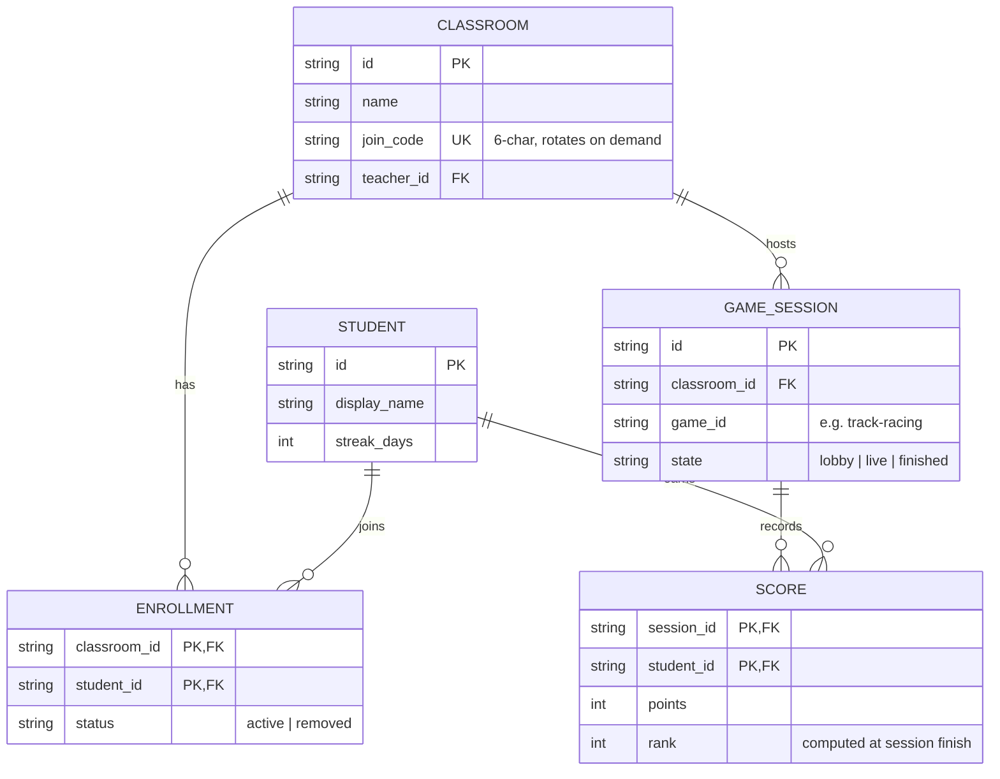

# Database design as diagram + dictionary

A schema needs two views: the **shape** (an ER diagram — relationships at a glance) and the
**contract** (a data dictionary — the field-level truth). Mermaid gives you the first; a table
gives you the second; both diff cleanly.

## The shape

## The contract

Only the fields where the diagram can't carry the nuance:

| Entity.field            | Type   | Rules                                                        |
| ----------------------- | ------ | ------------------------------------------------------------ |
| `CLASSROOM.join_code`   | string | Unique while active; rotating it orphans no enrollments      |
| `ENROLLMENT.status`     | enum   | `removed` keeps the row — history is never deleted           |
| `GAME_SESSION.state`    | enum   | Only legal walk: `lobby → live → finished`; no state skips   |
| `SCORE.rank`            | int    | Derived. Written once at `finished`; never recomputed after  |

## The drift-proof move

The diagram above will rot the day someone adds a column and forgets this file. The GitDATA
answer: make each entity a frontmattered file under `data/entities/`, declare the rules in
`data/_schema/`, and **generate** this document as a rollup. Then `--check` fails the PR when
diagram and truth disagree — the doc stops being a promise and becomes a build artifact.

That is the difference between *documenting* a schema and *tracking it as data*.
