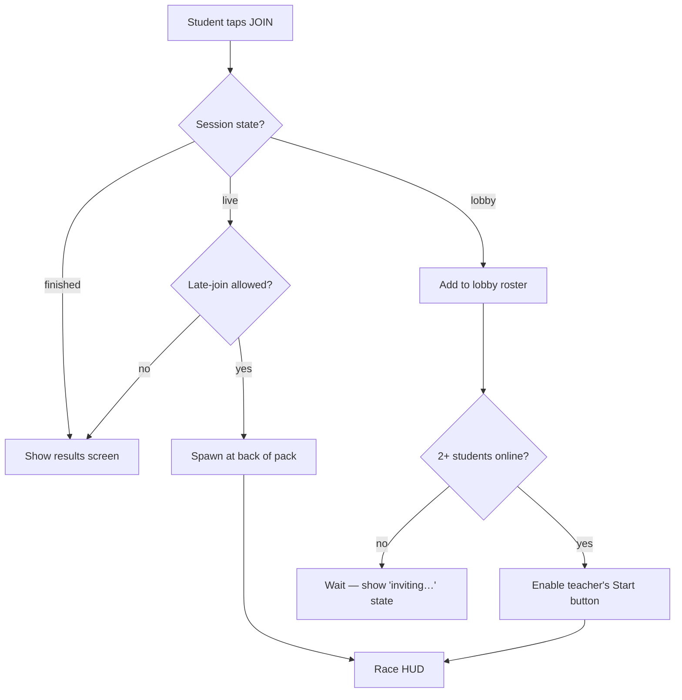
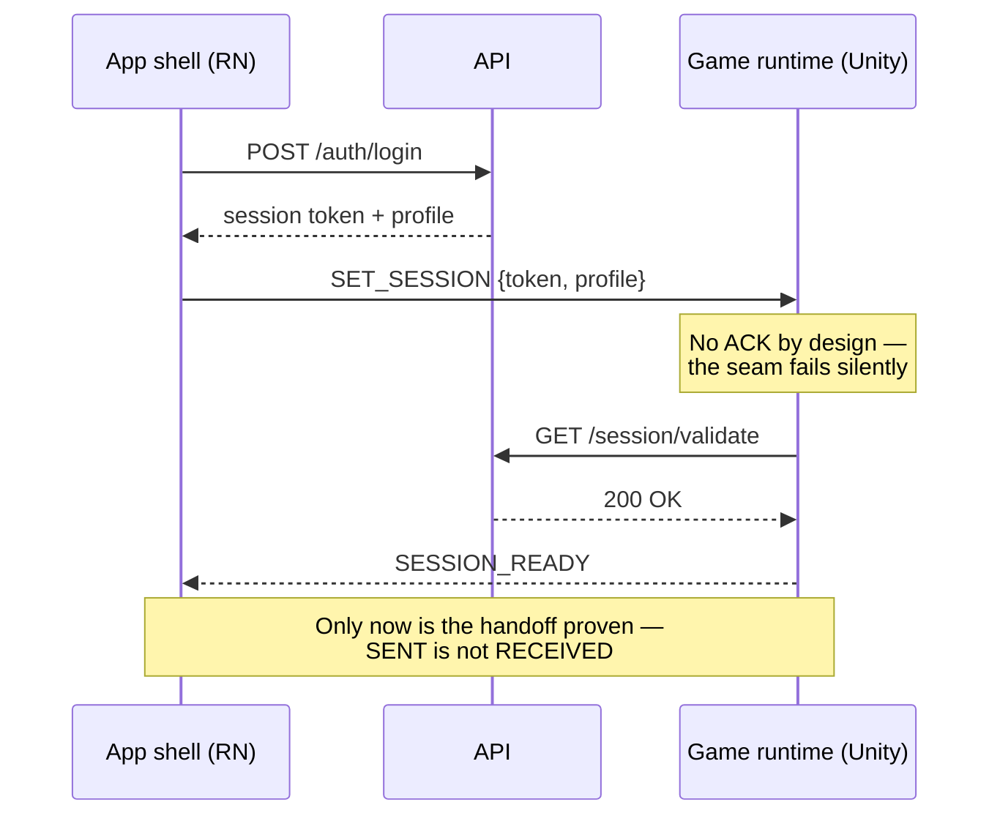

# Flows and sequences — process and protocol

Two different questions, two different diagrams. A **flowchart** answers *"what happens
next?"* — one actor's decisions through time. A **sequence diagram** answers *"who talks to
whom?"* — many actors, message by message. Using one where the other belongs is the most
common diagram mistake in PRs.

## Flowchart: what happens when a student joins a race

One decision per diamond, one verb per box. If a box needs a comma, it's two boxes.

## Sequence: the auth handoff (app shell → game runtime)

The two `Note` boxes carry the entire reason this diagram exists: the danger lives in the
gaps between arrows, and prose *inside* the diagram is the only place readers will see it.

## The rule of the missing arrow

The most valuable thing a sequence diagram can show is the arrow that **isn't there**. Here,
there is no `U-->>RN: ACK` after `SET_SESSION` — that absence is a design fact, and drawing
the diagram is how it gets noticed in review. A wall of prose would bury it; six arrows
expose it.
