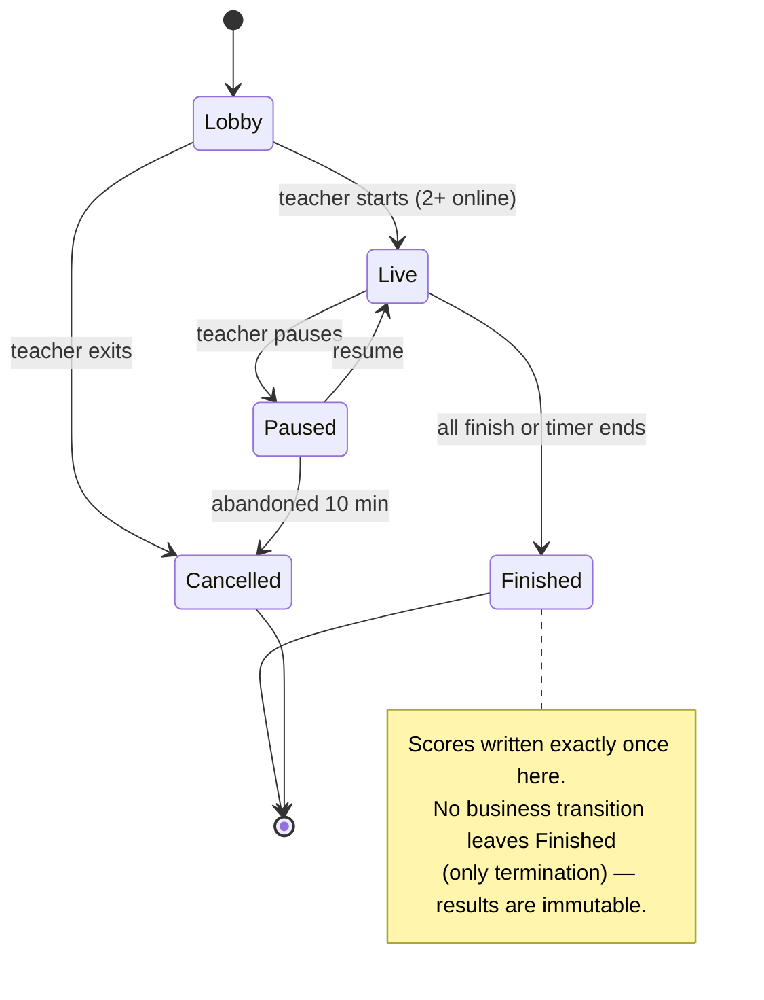
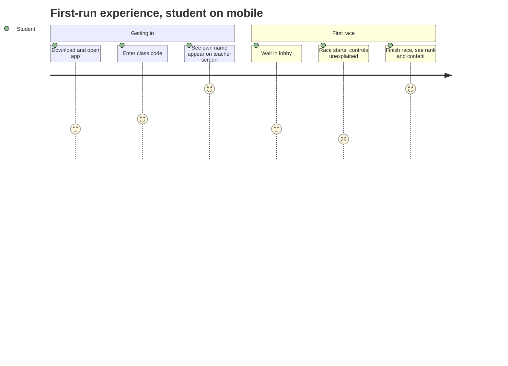
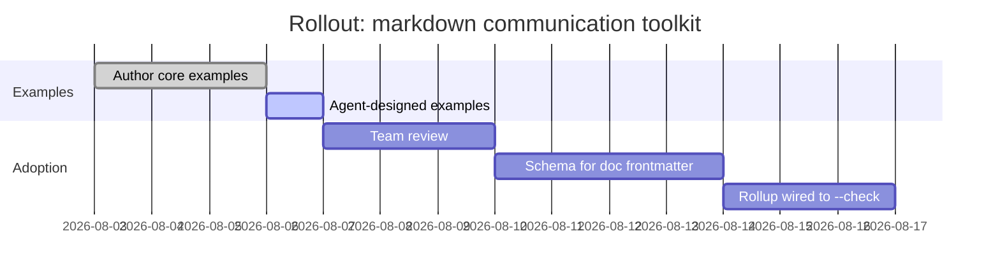
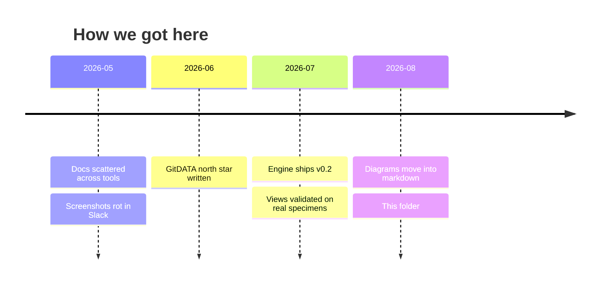

# States, journeys, and time

Three lenses on the same underlying thing — change over time — at three altitudes:
the **machine's** view (states), the **human's** view (journey), and the **project's** view
(plan and history).

## The machine: game session lifecycle

A state diagram is a contract: every arrow is a *permitted* transition, and everything not
drawn is *forbidden*. That second half is the valuable half — write it in the caption.

## The human: a student's first five minutes

The scores (1–7) are the point: two valleys — the lobby wait and the unexplained controls —
are now visible, ranked, and arguable. A journey diagram is a prioritization tool wearing a
UX costume.

## The project: plan forward, history backward

Gantt looks forward and invites correction ("review won't take 3 days"); timeline looks
backward and builds shared memory. Same axis, opposite jobs — don't merge them.
