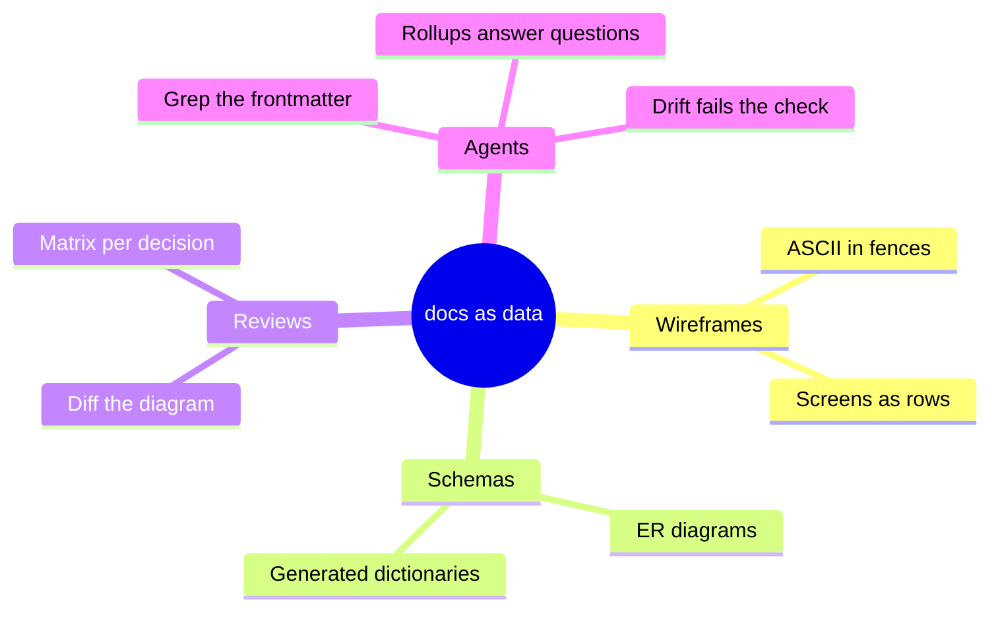
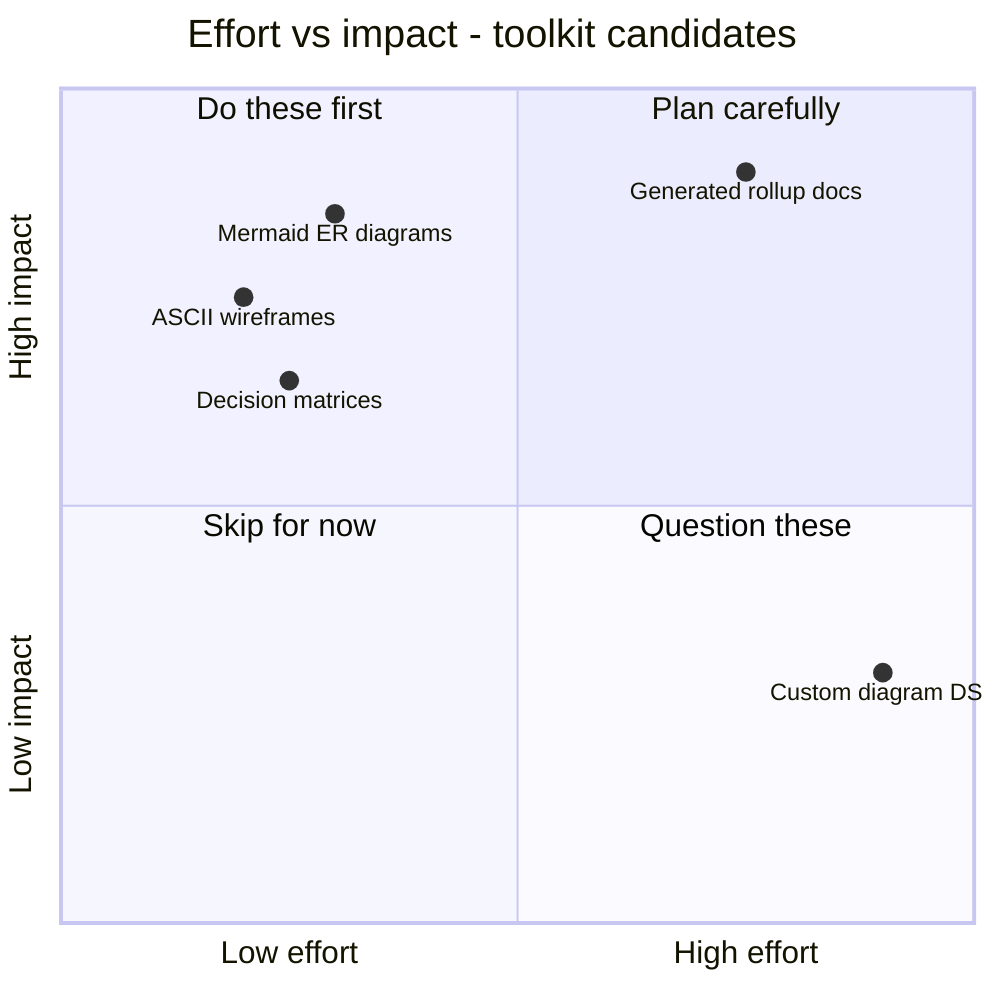

# Ideas and pitches — making the fuzzy sharp

Early ideas die two ways: too vague to act on, or formalized so early the good parts get
polished off. These three structures hold an idea at exactly the right firmness.

## Diverge: the mindmap

*Everything the idea could be, before choosing what it will be:*

A mindmap makes no commitments — no arrows, no order, no priority. That's its honesty: it
says "this is the territory," not "this is the plan."

## Converge: the quadrant

*The same ideas, now forced to declare their cost and worth:*

Placing a dot is a claim someone can dispute in review — which is precisely what a pitch
needs before anyone writes code. (Note the bottom-right resident: building our own diagram
language. The chart says what the law says: don't.)

## Commit: the one-pager

The narrowest structure that still counts as a pitch — every heading is a question, and a
pitch that can't fill a heading isn't ready:

> ### Problem
>
> Diagrams live outside git, so they rot silently and agents can't read them.
>
> ### Proposal
>
> Every diagram is mermaid or ASCII inside a frontmattered `.md`. Nothing binary.
>
> ### What we are NOT doing
>
> No diagram DSL. No rendering pipeline. No Figma migration mandate.
>
> ### First slice
>
> This folder. Cost: one PR. Reversal cost: `git revert`.
>
> ### How we'll know it worked
>
> Next design debate cites a diagram diff instead of a screenshot.

The **NOT doing** section is the highest-value heading in the doc — scope stated as data,
cheap to review, and the first thing readers look for whether you write it or not.
