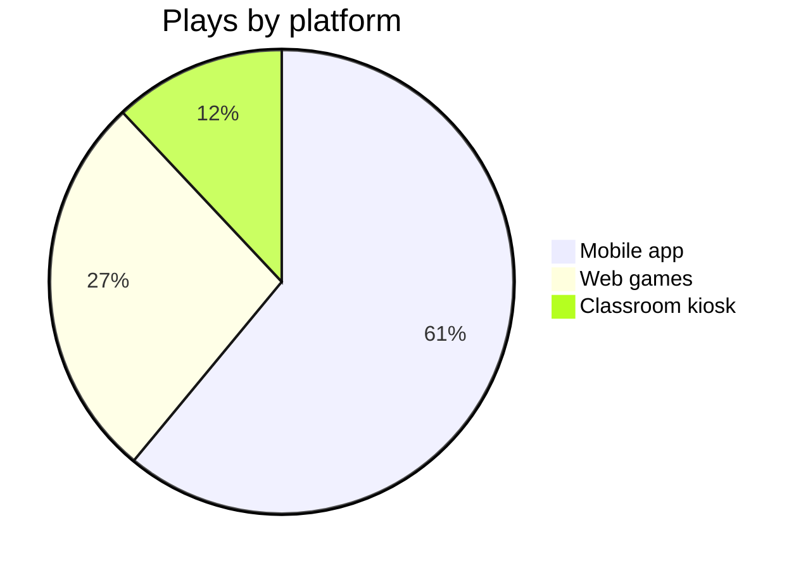

# Ops Pulse — Week of 2026-08-03

One invented week of activity for a small educational game platform, rendered
with nothing but plain text. Every widget below is diffable, greppable, and
renders natively on GitHub.

## Stat tiles

```
┌─────────────────┬─────────────────┬─────────────────┬─────────────────┐
│  ACTIVE PLAYERS │  GAMES PLAYED   │  QUIZ ACCURACY  │  CRASH-FREE     │
│      1,284      │      9,412      │      78.4%      │      99.2%      │
│   ▲ +6.1% wk    │   ▲ +11.3% wk   │   ▼ -1.2pt wk   │   ─ flat        │
└─────────────────┴─────────────────┴─────────────────┴─────────────────┘
```

## Daily activity — sparklines in a table

| Metric              | Mon | Tue | Wed | Thu | Fri | Sat | Sun | Trend     | Peak    |
|---------------------|----:|----:|----:|----:|----:|----:|----:|:----------|:--------|
| Sessions            | 812 | 940 | 1103| 1287| 1451| 623 | 510 | `▂▃▅▆█▂▁` | Fri     |
| Quizzes completed   | 301 | 355 | 402 | 498 | 530 | 180 | 141 | `▃▄▅▇█▂▁` | Fri     |
| New signups         |  34 |  41 |  29 |  77 |  90 |  12 |   9 | `▃▄▂▆█▁▁` | Fri     |
| Support tickets     |   6 |   4 |  11 |   5 |   3 |   2 |   1 | `▄▃█▃▂▂▁` | Wed 🔥  |

## Game popularity — horizontal bars

| Game          | Plays | Share of week                  |
|---------------|------:|--------------------------------|
| Track Racing  | 3,610 | `████████████████████░░` 38%   |
| Comet Quiz    | 2,540 | `██████████████░░░░░░░░` 27%   |
| Match-3       | 1,506 | `████████░░░░░░░░░░░░░░` 16%   |
| Word Search   |   988 | `█████░░░░░░░░░░░░░░░░░` 11%   |
| Flappy Bird   |   768 | `████░░░░░░░░░░░░░░░░░░`  8%   |

## Delivery board — kanban as a 3-column table

| 📋 Todo                        | 🔨 In progress                  | ✅ Done this week               |
|--------------------------------|---------------------------------|---------------------------------|
| Leaderboard pagination         | Quiz accuracy regression (`#412`) | Sparkline export endpoint     |
| Teacher weekly digest email    | Wed ticket spike root-cause     | Sign-in retry backoff           |
| Dark-mode for score screen     | Match-3 level 40 balance pass   | Crash reporter sampling fix     |
|                                |                                 | Fri load-test at 1.5k CCU       |

## Where the plays came from



## Reading the week

- **Friday is the platform's heartbeat** — sessions, quizzes, and signups all
  peak together (`▂▃▅▆█▂▁`), which points at in-class Friday tournaments.
- **Wednesday's ticket spike (11)** did not dent sessions; whatever broke was
  annoying, not blocking. Root-cause is on the board, in progress.
- **Quiz accuracy slipped 1.2pt** while volume rose 11% — likely new-cohort
  dilution from Friday's 90 signups, not a content regression. Watch one more week.

---

## When a text dashboard beats a real one — and when it doesn't

- **Beats one when the data is small and the audience is a repo**: it diffs in
  PRs (a changed bar is a changed line), greps from a terminal, needs zero
  infrastructure, and is readable over SSH, in `cat`, and in a code review.
- **Beats one when history matters more than interactivity**: every past week
  is a git commit — the dashboard's time-travel feature is `git log`.
- **Loses when data is live, large, or explored**: no drill-down, no
  auto-refresh, hand-scaled bars drift from the numbers, and unicode blocks
  cap resolution at ~8 levels. Past a few dozen rows or one update a day,
  reach for a real tool.
