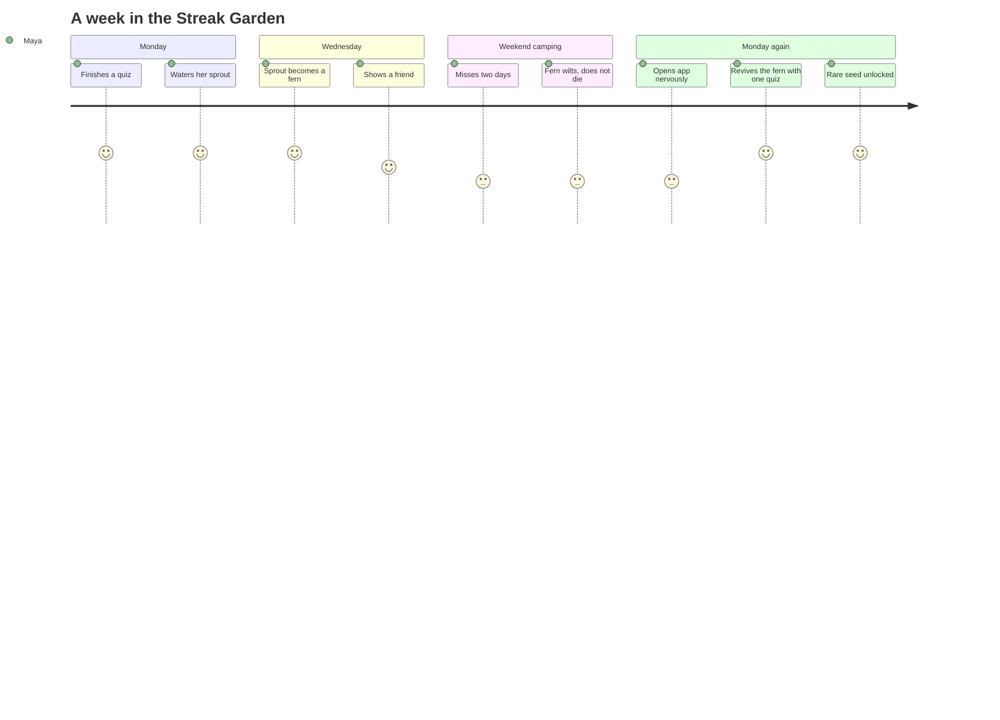
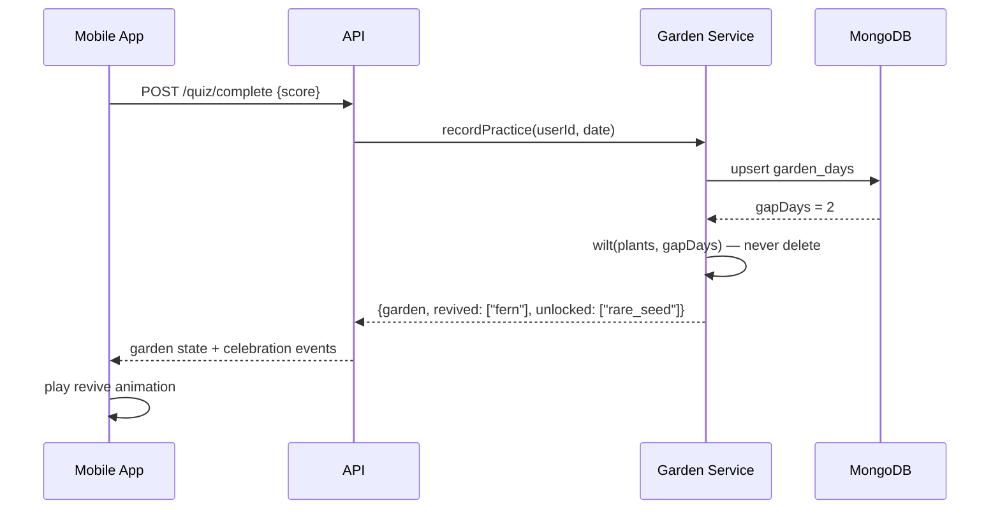

# Streak Garden

*A product idea told as a story — the prose is thin on purpose. The structure carries it.*

## The problem

Maya, age 11, did her math quizzes nine days in a row. On day ten her family went camping.
Her streak counter — a cold orange number — reset to zero. She never opened the app with the
same enthusiasm again. Streak numbers punish; they don't grow anything. What if a streak
wasn't a number you could lose, but a garden you could tend?

**Streak Garden:** every day of practice waters a plant. Miss a day and the plant wilts —
but it doesn't die. Come back and revive it. Long-term care grows rare species. Your garden
*is* your history, and history can't be reset.

## Maya's week



The emotional floor never drops to 1. That's the whole design.

## The moment of use

What Maya sees when she returns after the camping trip:

```text
+----------------------------------+
|  YOUR GARDEN            [day 12] |
|                                  |
|   .--.        \|/        _       |
|  ( 🌷 )      --🥀--     (🌱)     |
|   `--'        /|\        --      |
|  tulip     fern needs   new seed |
|  day 12     water!      (rare)   |
|                                  |
|  +----------------------------+  |
|  |  💧 Revive your fern —     |  |
|  |     one quiz brings it back|  |
|  |        [ START QUIZ ]      |  |
|  +----------------------------+  |
+----------------------------------+
```

One wilted plant. One button. No shame, no zero.

## How it works



The key rule lives in one place: `wilt()` degrades state, nothing ever deletes it.

## What we'd measure

| Metric | Today (streak counter) | Target (garden) | Why it matters |
| --- | --- | --- | --- |
| Day-after-lapse return rate | 22% | 45% | The core bet: wilting invites, zero repels |
| 30-day retention | 31% | 40% | Gardens accumulate; counters reset |
| Sessions after first lapse | 1.8/wk | 3.5/wk | Revival becomes a reason to open |
| "Show a friend" shares | — | 5% of DAU | A garden is worth showing; a number isn't |

## The end of the story

Six months in, Maya's garden has a wilted patch from spring break — and she likes it.
It's proof she came back. The feature ships when the sequence diagram above is boring
and the journey diagram above is true.
