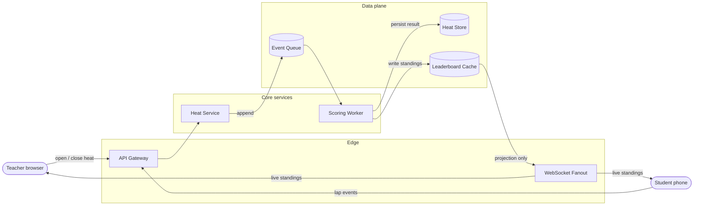
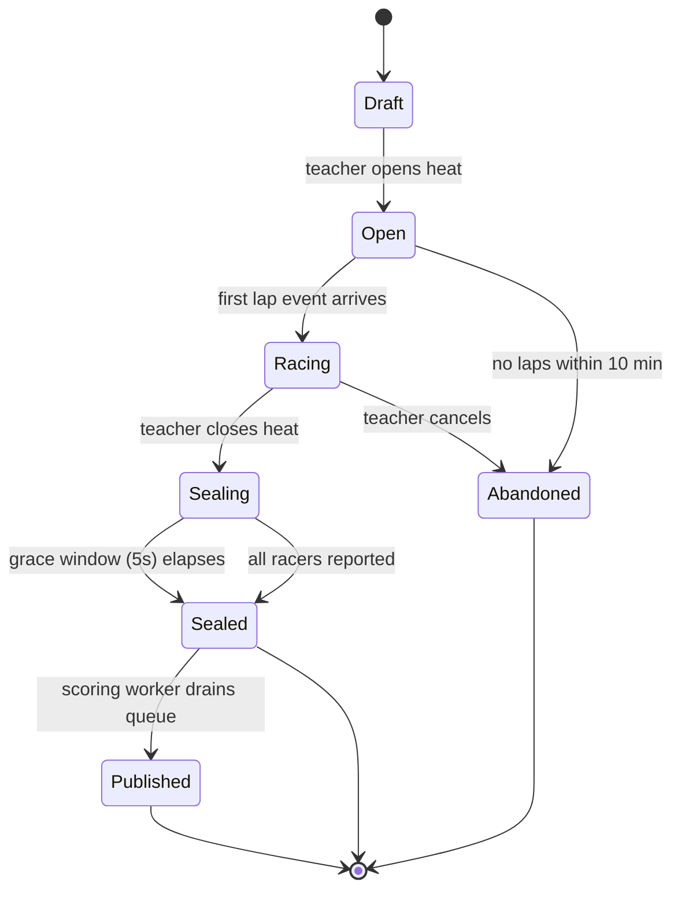

# Relay Heats: one system, three altitudes

An invented backend that runs live racing "heats" for a classroom: the teacher opens a heat,
students race from their phones, results roll up to a leaderboard. Same system, three zoom levels.

## Altitude 1 — Context & containers (C4-ish)

**Claim: every *external* heat mutation enters through the Heat Service — clients never write to the data plane directly, and the leaderboard is a read-only projection that can never write back.**



## Altitude 2 — The heat lifecycle

**Claim: `Sealing` is the only state where late lap events are still accepted, and it is time-boxed — nothing re-opens a sealed heat.**



## Altitude 3 — The one failure that lies to everyone

**Claim: a stalled Scoring Worker produces a *plausible but frozen* leaderboard — the system's worst failures look like success.**

```text
  Student laps ──► Queue ──► [ SC stalled ✗ ] ──► Leaderboard Cache
                    │                                  │
                    │  events pile up,                 │  serves LAST GOOD standings
                    ▼  nothing errors                  ▼  (stale, but well-formed)
              depth grows silently          teacher sees a "live" board
                                            that stopped 40 seconds ago
```

| Property of this failure | Why it is the dangerous one                              |
| ------------------------ | -------------------------------------------------------- |
| No error surfaces        | Queue accepts writes; cache serves reads; all 200s        |
| Output stays plausible   | A frozen leaderboard looks identical to a quiet race      |
| Detection requires delta | Only cure: alarm on `queue depth > 0 AND cache age > 10s` |

## What this map deliberately omits

| Omitted                        | Why                                                        |
| ------------------------------ | ---------------------------------------------------------- |
| Auth / identity flow           | Orthogonal to heat mechanics; would double the box count    |
| Horizontal scaling & sharding  | Premature at one-classroom load; the shapes hold either way |
| Retry / dead-letter policy     | Belongs in a runbook, not a map — this doc sets the terrain |
